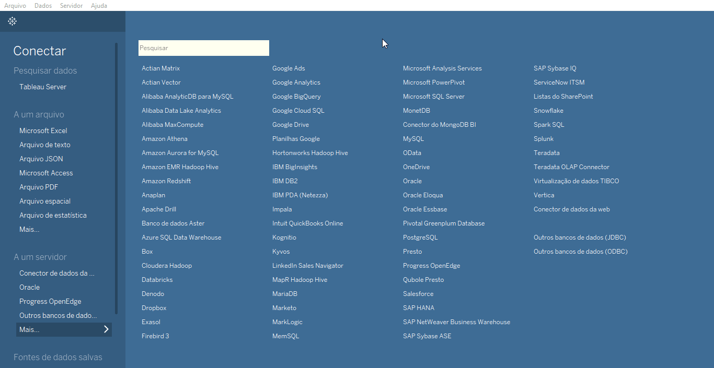

# tableauWDC_covid19
Web Data Connector para Tableau usando a API https://brasil.io/api/dataset/covid19

**Pré-requisitos:**
- Node

## Instruções WDC:
1. Clonar o repositório:
`git clone https://github.com/cccadet/tableauWDC_covid19.git`

2. Abrir o repositório em um terminal de linha de comando.

3. Instalar pacotes caso não estejam instalados.
`npm install --production`

4. Iniciar o serviço.
`npm start`

5. Para testar basta abrir o navegador no endereço:
`http://localhost:8888/Simulator/index.html`

6. No campo **Connector URL** informar o seguinte caminho:
`../covid19codeio/html/covid19.html`

7. Clicar em **Start Interactive Phase** e uma janela será aberta. 

8. Clicar em **Get Data**.

OBS.: O endereço exibido nesta janela é o que deve ser copiado para realizar a conexão no Tableau.

9. Clicar em **Fetch Table Data** e verificar se os dados foram exibidos corretamente. Caso sim, é possível usar os dados no Tableau Desktop para publicação de bases.

## Conectar no Tableau

## Material de Apoio Tableau
WDS Get Started
 - https://tableau.github.io/webdataconnector/docs/index.html
WDS no Tableau Server:
 - https://help.tableau.com/current/server-linux/pt-br/datasource_wdc.htm
 - https://help.tableau.com/current/server-linux/pt-br/cli_data-access.htm#web-data-connectors-add

## Licença

A licença do código é [LGPL3](https://www.gnu.org/licenses/lgpl-3.0.en.html) e
dos dados convertidos [Creative Commons Attribution
ShareAlike](https://creativecommons.org/licenses/by-sa/4.0/). Caso utilize os
dados, **cite a fonte original e quem tratou os dados**, como: **Fonte:
Secretarias de Saúde das Unidades Federativas, dados tratados por Álvaro
Justen/[Brasil.IO](https://brasil.io/)**. Caso compartilhe os dados, **utilize
a mesma licença**.
